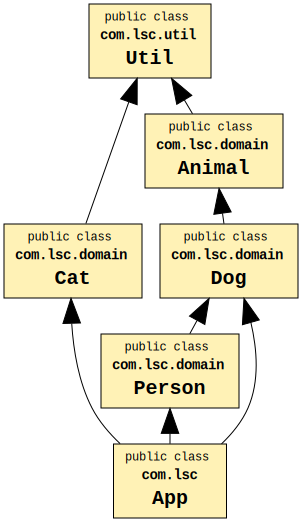
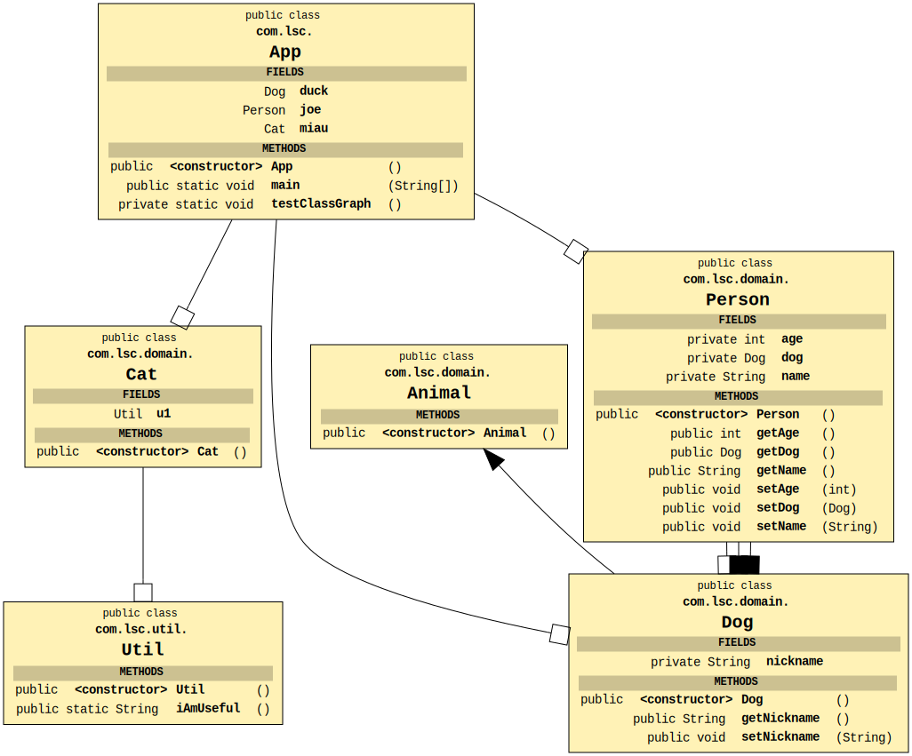

# Testing ClassGraph

https://github.com/classgraph/classgraph

## Inter-class Dependencies

## Showing the type of Relationships

ps: *the Animal and Util relationship is not shown for this type of graph*

## Create dot file

run App.java

## Create svg from dot file

dot -Tsvg < classgraph.dot > classgraph.svg

